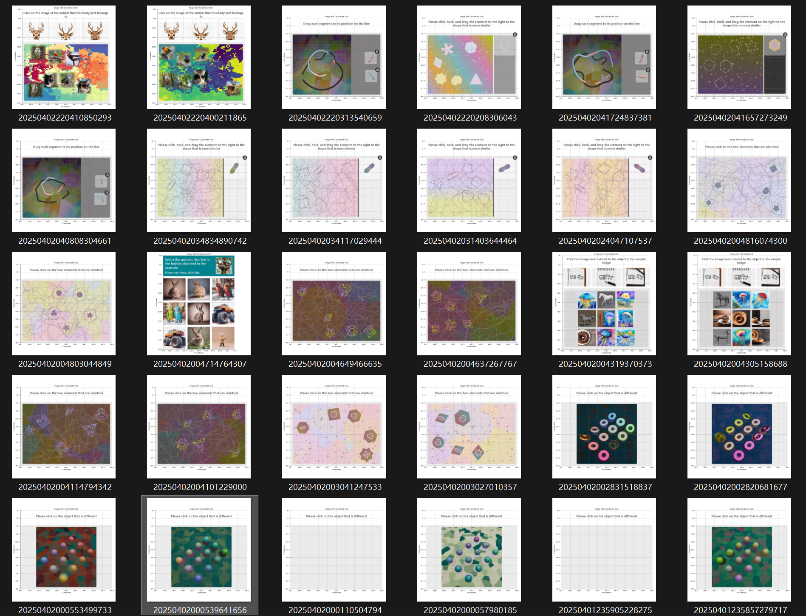

# Документация

## Начало работы

### Введение

hCaptcha Challenger (версии 0.13.0 и выше) использует возможности пространственного рассуждения (Spatial Chain-of-Thought), встроенные в крупные языковые модели, для построения агентского рабочего процесса, позволяющего агентам следовать инструкциям и выполнять общие пространственно-визуальные задачи без дополнительного обучения или донастройки.

`Agent` управляет страницами браузера через Playwright. В вашем рабочем процессе Agent инициализируется объектом `Page`, передаваемым вами, что позволяет Agent'у полностью перехватить взаимодействие с текущей страницей. Через Agent можно реализовать две независимые операции: `click_checkbox` (нажатие на флажок) и `wait_for_challenge` (ожидание появления задания).

hCaptcha является одним из пионеров в применении технологий диффузии и синтеза изображений в сфере CAPTCHA. Благодаря стремительному развитию инженерии автоматизации, hCaptcha способна чрезвычайно часто обновлять типы своих заданий. За последние два года сообщество столкнулось с возрастающими сложностями обработки таких часто меняющихся задач «человек-машина». Традиционные сверточные нейронные сети (CNN) испытывают значительные трудности с достижением хорошей обобщающей способности при обучении на небольших наборах данных для задач обнаружения объектов. Полноценная процедура тонкой настройки обычно требует значительного времени и усилий, зачастую занимая до половины недели, чтобы подготовить CNN-модель, пригодную для продакшн-среды. Однако к моменту завершения обучения hCaptcha может уже обновить типы своих заданий, делая недавно обученную модель быстро устаревающей или неэффективной.

Следовательно, сообщество срочно нуждается в надежном, универсальном решении, способном эффективно решать разнообразные пространственно-визуальные задачи. Независимо от того, как часто hCaptcha обновляет типы своих проверок, **такое решение должно быстро адаптироваться к изменениям среды и автономно управлять браузерами для решения различных задач CAPTCHA без участия человека.**

### Установка

```
uv pip install hcaptcha-challenger
```

### Быстрый старт

Этот документ описывает подход автоматизации задач hCaptcha и показывает, как эффективно взаимодействовать с элементами hCaptcha через интерфейс роботизированной руки агента.

Важно подчеркнуть, что Agent взаимодействует исключительно со страницами браузера через объект Page. Вследствие этого Agent может беспрепятственно работать на любой платформе или «патчере», построенном на основе Playwright. На практике это означает, что любой браузер, поддерживаемый и запускаемый Playwright, может использоваться для выполнения Agent'a по этому методу.

В следующем примере вам нужно создать и настроить ваш [GEMINI_API_KEY](https://aistudio.google.com/apikey):

```python
import asyncio
import json

from playwright.async_api import async_playwright, Page

from hcaptcha_challenger.agent import AgentV, AgentConfig
from hcaptcha_challenger.models import CaptchaResponse
from hcaptcha_challenger.utils import SiteKey


async def challenge(page: Page):
    # Initialize the agent configuration with API key (from parameters or environment)
    agent_config = AgentConfig()

    # Create an agent instance with the page and configuration
    # AgentV appears to be a specialized agent for visual challenges
    agent = AgentV(page=page, agent_config=agent_config)

    # Click the hCaptcha checkbox to initiate the challenge
    # The robotic_arm is an abstraction for performing UI interactions
    await agent.robotic_arm.click_checkbox()

    # Wait for the challenge to appear and be ready for solving
    # This may involve waiting for images to load or instructions to appear
    await agent.wait_for_challenge()

    # Note: The code ends here, suggesting this is part of a larger solution
    # that would continue with challenge solving steps after this point
    if agent.cr_list:
        cr: CaptchaResponse = agent.cr_list[-1]
        print(json.dumps(cr.model_dump(by_alias=True), indent=2, ensure_ascii=False))
        return cr


async def main():
    async with async_playwright() as p:
        browser = await p.chromium.launch(headless=False)
        context = await browser.new_context()

        # Create a new page in the provided browser context
        page = await context.new_page()

        # Navigate to the hCaptcha test page using a predefined site key
        # SiteKey.user_easy likely refers to a test/demo hCaptcha with lower difficulty
        # await page.goto(SiteKey.as_site_link(SiteKey.discord))
        await page.goto(SiteKey.as_site_link(SiteKey.user_easy))

        # --- Suppose you encounter hCaptcha in your browser ---
        await challenge(page)


if __name__ == "__main__":
    encrypted_resp = asyncio.run(main())
    
```

## Галерея



### Бинарная маркировка изображений